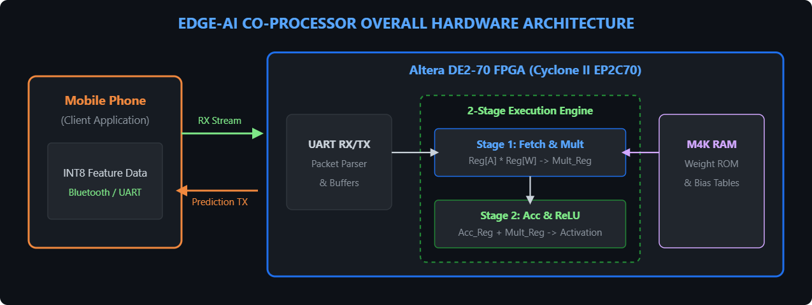
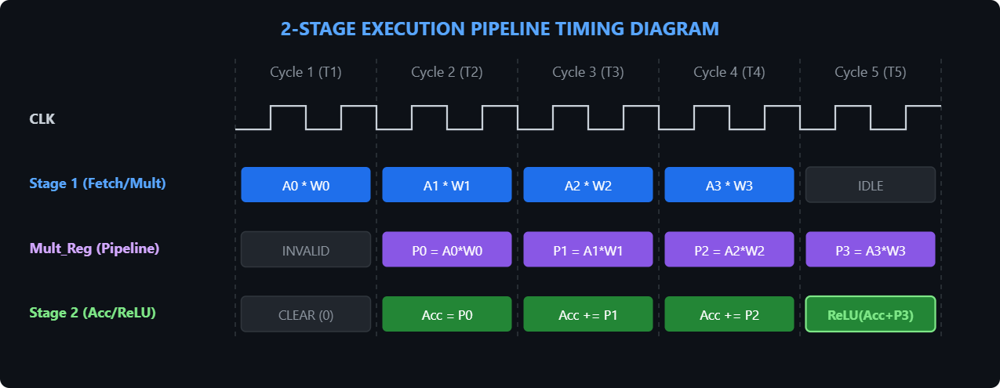
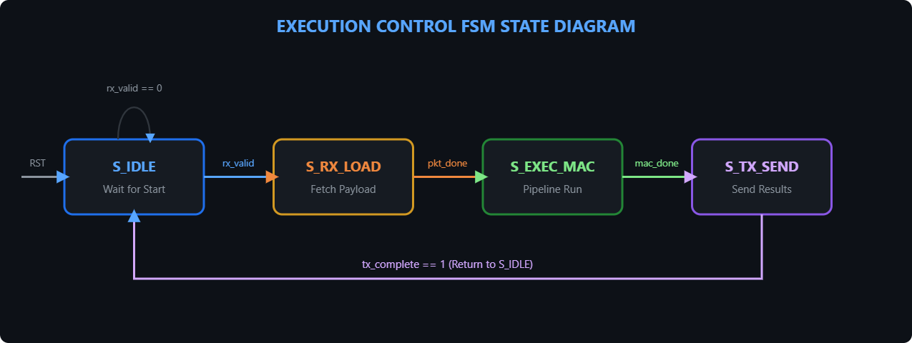
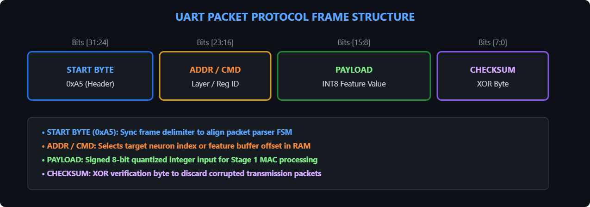
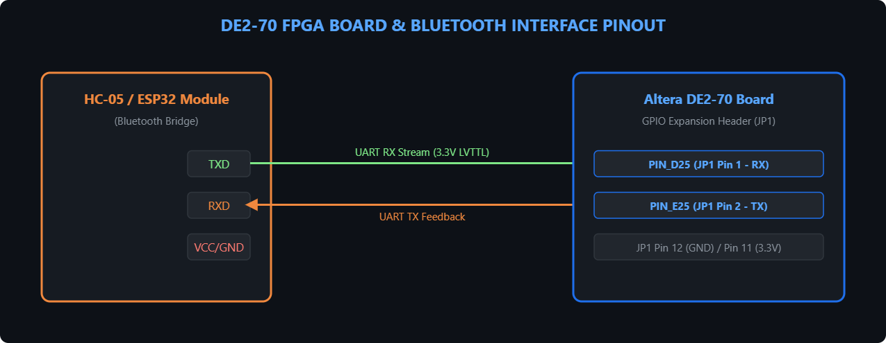

# Phone-Connected 2-Stage Pipelined Edge-AI Accelerator Co-Processor


An ultra-lightweight, hardware-accelerated Edge-AI co-processor implemented on the **Altera DE2-70 (Cyclone II)** FPGA platform. Featuring a custom **2-stage pipelined Multiply-Accumulate (MAC) execution engine**, M4K-based weight ROM buffers, and a real-time **Bluetooth/UART wireless interface** to offload neural network inference from mobile devices.

---

## 💡 Executive Summary & Non-Technical Overview

Modern mobile applications rely heavily on Artificial Intelligence (AI) for real-time tasks like image recognition, sensor diagnostics, and predictive data processing. Running these heavy mathematical models directly on a smartphone processor drains the battery quickly and generates significant heat.

This project introduces a **dedicated external hardware co-processor**:
1. **Offloaded Computation:** The smartphone captures sensor data and transmits raw features wirelessly via Bluetooth.
2. **Hardware Acceleration:** The FPGA board receives the data, processes neural network math using dedicated physical logic gates (MAC units), and calculates predictions in microseconds.
3. **Low-Power Intelligence:** The result is returned to the mobile app instantly, drastically reducing phone power consumption and preserving CPU bandwidth for the user interface.

---

## 🎯 Key System Features

* **Custom Hardware Datapath:** 2-stage execution pipeline operating zero-stall matrix operations at 50 MHz.
* **INT8 Quantized Arithmetic:** Reduces memory overhead by 75% compared to standard 32-bit floating-point math while maintaining target model accuracy.
* **Seamless Mobile Offloading:** Wireless Bluetooth bridge (HC-05 / ESP32) operating via 3.3V LVTTL UART.
* **On-Chip Memory Integration:** Pre-loaded neural network weights mapped directly into Cyclone II embedded M4K memory blocks using `.mif` (Memory Initialization Files).
* **Comprehensive Verification Suite:** Complete hardware simulation testbenches written for ModelSim alongside Quartus II hardware compilation scripts.

---

## 💡 Beginner's High-Level Concept Guide

If you are new to FPGA hardware acceleration or deep learning hardware, here is how the core concepts work:

* **What is an FPGA?** A Field-Programmable Gate Array (FPGA) is a microchip containing thousands of configurable logic blocks. Unlike a fixed phone or computer CPU, we can reconfigure the hardware circuits on the FPGA to build specialized computing engines.
* **What is a 2-Stage Pipeline?** Think of an assembly line. While **Stage 2** is calculating the current math operation (Multiply-Accumulate), **Stage 1** is already pre-fetching the next set of numbers from memory. This allows the system to process one calculation every single clock cycle without stopping.
* **What is INT8 Quantization?** Standard AI models use 32-bit floating-point decimal numbers. We compress these weights into signed 8-bit integers (`-128` to `+127`). This minimizes hardware complexity and memory footprints without significant accuracy loss.

---

## 🛠 System Prerequisites & Environment Setup

### Required Hardware
* **FPGA Development Board:** Altera DE2-70 (EP2C70F896C6)
* **Programmer Cable:** USB-Blaster download cable
* **Wireless Transceiver:** HC-05 Bluetooth Module or ESP32 microcontroller board
* **Host Device:** Android/iOS smartphone or Bluetooth-enabled host terminal

### Required Software & Toolchain
* **Synthesis & Compilation:** Intel / Altera Quartus II v13.0sp1 Web Edition
* **HDL Simulation:** ModelSim-Altera Starter / Edition
* **HDL Source Code Editor:** VS Code with Verilog HDL / SystemVerilog extension
* **Machine Learning & Export Toolchain:** Python 3.8+ (PyTorch, NumPy, SciPy)

---

## 📌 System Hardware Specifications

* **Target Hardware:** Altera DE2-70 Development Board (Cyclone II EP2C70)
* **Design Environment:** Intel Quartus II 13.0sp1 & ModelSim-Altera Edition
* **Data Format:** Signed 8-bit Integer (INT8)
* **Clock Frequency:** 50 MHz On-board Oscillator (`CLOCK_50`)
* **Communication Interface:** UART over HC-05 / ESP32 Bluetooth Bridge (115200 Baud, 8N1)



---

## ⏱️ Execution Pipeline & Timing Waveform

The 2-stage execution pipeline processes incoming features sequentially. Stage 1 calculates intermediate products ($A_i \times W_i$), while Stage 2 evaluates the running accumulator ($Acc + P_i$) and applies a non-linear ReLU activation function.



---

## 🕹️ Top-Level Finite State Machine (FSM)

The top-level controller coordinates state switches from initial idle waiting to packet parsing, hardware pipeline execution, and final output transmission back to the mobile app.



### Communication Packet Format
Commands and feature data packets are transmitted as 32-bit structured frames with start header validation and XOR checksum bit verification.



---

## 🔌 Hardware Wiring & Pin Mapping

The Bluetooth bridge communicates with the DE2-70 using 3.3V LVTTL logic via the GPIO Expansion Header 1 (JP1).



| Signal Name | FPGA Pin | Header Pin | Description |
| :--- | :--- | :--- | :--- |
| `UART_RXD` | `PIN_D25` | JP1 Pin 1 | Data receive line from HC-05/ESP32 TX |
| `UART_TXD` | `PIN_E25` | JP1 Pin 2 | Data transmit line to HC-05/ESP32 RX |
| `VCC33` | — | JP1 Pin 11 | 3.3V Power Supply |
| `GND` | — | JP1 Pin 12 | System Ground Line |

---

## 👥 Team Delegation & Functional Roles

| Role | Primary Lead | Subsystem Directory | Core Responsibilities |
| :--- | :--- | :--- | :--- |
| **RTL Core Lead** | Member 1 | `rtl/core/` | 2-Stage pipelined MAC datapath, ALU registers, and arithmetic unit |
| **Control Logic Lead** | Member 2 | `rtl/control/` | Top-level execution FSM, timing state management, and control flags |
| **Memory Architecture Lead** | Member 3 | `rtl/memory/` | M4K RAM/ROM wrappers, address generator unit, and `.mif` loading |
| **Communication Interface Lead** | Member 4 | `rtl/interface/` | UART receiver/transmitter modules, baud rate generator, and packet parsing |
| **ML & Quantization Lead** | Member 5 | `models/` | Model training, INT8 post-training quantization, and `.mif` export scripts |
| **Verification & Testing Lead** | Member 6 | `tb/` | ModelSim unit/system testbenches, timing checks, and functional verification |
| **Systems & Mobile App Lead** | Member 7 | `app/`, `fpga/` | Host mobile app UI, Bluetooth firmware bridge, and `.qsf` pin assignments |

---

## 📁 Repository Directory Structure

```text
edge-ai-coprocessor/
├── app/               # Host mobile application and firmware
│   ├── client/        # Android/iOS client UI for feature input
│   └── firmware/      # ESP32/HC-05 Bluetooth pass-through code
├── docs/              # Visual diagrams, specifications, and reports
│   ├── architecture/  # Microarchitecture specifications
│   ├── assets/        # Documentation PNG diagrams
│   ├── protocols/     # Frame protocols & memory mapping
│   └── reports/       # Synthesis and timing verification reports
├── fpga/              # Quartus II workspace and constraint files
│   ├── constraints/   # Pin assignment configuration (.qsf)
│   ├── quartus/       # Quartus project database (.qpf)
│   └── scripts/       # Tcl synthesis and programming scripts
├── models/            # Model training, quantization, and MIF generation
│   ├── export/        # Quantized INT8 weights & generated .mif files
│   ├── quantization/  # Post-training quantization scripts
│   └── training/      # PyTorch/TensorFlow training code
├── rtl/               # Hardware Description Language (Verilog) source
│   ├── control/       # Main execution FSM logic
│   ├── core/          # 2-Stage MAC datapath
│   ├── interface/     # UART/Bluetooth hardware module
│   └── memory/        # M4K memory wrappers & weight ROMs
└── tb/                # ModelSim verification testbenches
    ├── integration/   # Multi-module interface testbenches
    ├── system/        # End-to-end full system testbenches
    └── unit/          # Isolated module testbenches
