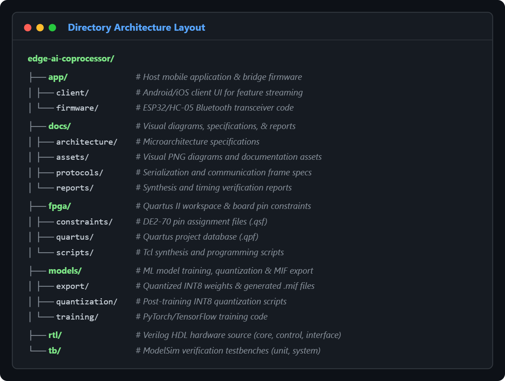

# Phone-Connected 2-Stage Pipelined Edge-AI Accelerator Co-Processor


An ultra-lightweight, hardware-accelerated Edge-AI co-processor implemented on the **Altera DE2-70 (Cyclone II)** platform. Featuring a custom **2-stage pipelined MAC execution engine**, M4K-based weight ROM buffers, and a real-time **Bluetooth/UART interface** to offload neural network inference from mobile devices.

---

## 💡 Beginner's High-Level Concept Guide

If you are new to FPGA hardware acceleration or deep learning hardware, here is how this system works in simple terms:

* **What is an Edge-AI Accelerator?** Instead of running heavy neural network computations on a phone CPU (which drains battery and heats up the phone), the phone sends raw input data to our FPGA board. The FPGA computes the AI predictions in dedicated silicon hardware and sends the answer back.
* **What is a 2-Stage Pipeline?** Think of an assembly line. While **Stage 2** is calculating the current math operation (Multiply-Accumulate), **Stage 1** is already pre-fetching the next set of numbers from memory. This allows the system to compute one operation per clock cycle without waiting.
* **What is INT8 Quantization?** Standard AI models use 32-bit floating-point decimal numbers. We compress these weights into 8-bit integers (`-128` to `+127`). This drastically reduces FPGA memory usage and allows simple integer math hardware.

---

## 📌 System Hardware Specifications

* **Target Hardware:** Altera DE2-70 Development Board (EP2C70F896C6)
* **Design Environment:** Intel Quartus II 13.0sp1 & ModelSim-Altera Edition
* **Data Format:** Signed 8-bit Integer (INT8)
* **Clock Frequency:** 50 MHz On-board Oscillator (`CLOCK_50`)
* **Communication Interface:** UART over HC-05 / ESP32 Bluetooth Bridge (115200 Baud)


---

## ⏱️ Execution Pipeline & Timing Waveform

The 2-stage execution pipeline processes incoming features sequentially. Stage 1 calculates intermediate products ($A_i \times W_i$), while Stage 2 evaluates the running accumulator ($Acc + P_i$) and applies a non-linear ReLU activation function.


---

## 🕹️ Top-Level Finite State Machine (FSM)

The top-level controller coordinates state switches from initial idle waiting to packet parsing, hardware pipeline execution, and final output transmission back to the mobile app.


### Communication Packet Format
Commands and feature data packets are transmitted as 32-bit structured frames with start header validation and XOR checksum bit verification.


---

## 🔌 Hardware Wiring & Pin Mapping

The Bluetooth bridge communicates with the DE2-70 using 3.3V LVTTL logic via the GPIO Expansion Header 1 (JP1).


| Signal Name | FPGA Pin | Header Pin | Description |
| :--- | :--- | :--- | :--- |
| `UART_RXD` | `PIN_D25` | JP1 Pin 1 | Data receive line from HC-05/ESP32 TX |
| `UART_TXD` | `PIN_E25` | JP1 Pin 2 | Data transmit line to HC-05/ESP32 RX |
| `VCC33` | — | JP1 Pin 11 | 3.3V Power Supply |
| `GND` | — | JP1 Pin 12 | System Ground Line |

---

## 👥 Team Delegation & Functional Roles

| Role | Primary Lead | Subsystem Directory | Core Responsibilities |
| :--- | :--- | :--- | :--- |
| **RTL Core Lead** | Member 1 | `rtl/core/` | 2-Stage pipelined MAC datapath, ALU logic, and registers |
| **Control & Memory Lead**| Member 2 | `rtl/control/`, `rtl/memory/` | FSM controller, address generator, and M4K RAM `.mif` loading |
| **Interface Lead** | Member 3 | `rtl/interface/` | UART receiver/transmitter modules and packet parsing FSM |
| **Verification Lead** | Member 4 | `tb/` | ModelSim testbench creation, unit testing, and timing checks |
| **Systems & App Lead** | Member 5 | `app/`, `fpga/` | Mobile client app UI, Bluetooth driver, pin mapping constraints |

---

## 📁 Repository Directory Structure



```text
edge-ai-coprocessor/
├── app/               # Host mobile application and firmware
│   ├── client/        # Android/iOS client UI for feature input
│   └── firmware/      # ESP32/HC-05 Bluetooth pass-through code
├── docs/              # Visual diagrams, specifications, and reports
│   ├── architecture/  # Microarchitecture specifications
│   ├── assets/        # Documentation PNG diagrams
│   ├── protocols/     # Frame protocols & memory mapping
│   └── reports/       # Synthesis and timing verification reports
├── fpga/              # Quartus II workspace and constraint files
│   ├── constraints/   # Pin assignment configuration (.qsf)
│   ├── quartus/       # Quartus project database (.qpf)
│   └── scripts/       # Tcl synthesis and programming scripts
├── models/            # Model training, quantization, and MIF generation
│   ├── export/        # Quantized INT8 weights & generated .mif files
│   ├── quantization/  # Post-training quantization scripts
│   └── training/      # PyTorch/TensorFlow training code
├── rtl/               # Hardware Description Language (Verilog) source
│   ├── control/       # Main execution FSM logic
│   ├── core/          # 2-Stage MAC datapath
│   ├── interface/     # UART/Bluetooth hardware module
│   └── memory/        # M4K memory wrappers & weight ROMs
└── tb/                # ModelSim verification testbenches
    ├── integration/   # Multi-module interface testbenches
    ├── system/        # End-to-end full system testbenches
    └── unit/          # Isolated module testbenches
